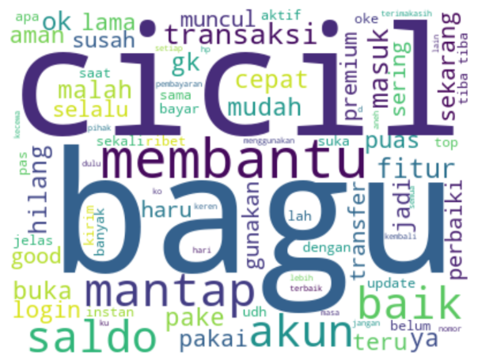

# DCN App Review Visualization

Dashboard interaktif untuk menganalisis review pengguna aplikasi DANA menggunakan Streamlit.




## 🌟 Features

- **Rating Distribution** - Visualisasi distribusi rating pengguna (bar chart & pie chart)
- **Daily Review Trends** - Analisis tren review harian
- **Wordcloud Visualization** - Visualisasi kata kunci dominan per rating
- **Keyword Frequency Analysis** - Top 100 kata kunci paling sering muncul
- **Dataset Info** - Informasi missing value dan tipe data

## 🛠️ Tech Stack

- **Python** - Bahasa pemrograman utama
- **Streamlit** - Framework untuk web app interaktif
- **Pandas** - Manipulasi dan analisis data
- **Matplotlib** - Visualisasi data
- **Seaborn** - Statistical data visualization
- **WordCloud** - Visualisasi word cloud

## 🚀 Quick Start

### Clone Repository

```bash
git clone https://github.com/shineistu86/dcn-visualization.git
cd dcn-visualization
```

### Install Dependencies

```bash
pip install -r requirements.txt
```

### Run Streamlit

```bash
streamlit run app.py
```

Dashboard akan terbuka di browser Anda pada `http://localhost:8501`

## 📂 Project Structure

```
dcn-visualization/
├── app.py                      # Main Streamlit application
├── requirements.txt            # Python dependencies
├── README.md                   # Project documentation
├── .gitignore                  # Git ignore rules
├── data/
│   └── dcn_crawlingdata_(1).csv    # Dataset
└── assets/
```

## 📁 Dataset

Dataset berisi hasil crawling review aplikasi DANA dari Google Play Store dengan kolom:

| Kolom | Deskripsi |
|-------|-----------|
| `reviewId` | ID unik review |
| `userName` | Nama pengguna |
| `content` | Isi review text |
| `score` | Rating (1-5) |
| `review_datetime` | Tanggal dan waktu review |
| `thumbsUpCount` | Jumlah thumbs up |
| `replyContent` | Balasan dari developer |

## 🌐 Live Demo

[](https://dcn-visualization.streamlit.app)
